# Documentación de Arquitectura — Clinic API

Modelo C4 completo del sistema de gestión clínica. Los diagramas siguen el estándar **C4 Model** (Context → Container → Component → Code) usando notación **Mermaid**.

---

## Tabla de Contenidos

- [Nivel 1 — Diagrama de Contexto del Sistema](#nivel-1--diagrama-de-contexto-del-sistema)
- [Nivel 2 — Diagrama de Contenedores](#nivel-2--diagrama-de-contenedores)
- [Nivel 3 — Diagrama de Componentes (API)](#nivel-3--diagrama-de-componentes-api)
- [Nivel 3 — Diagrama de Componentes (Dominio)](#nivel-3--diagrama-de-componentes-dominio)
- [Flujos de Secuencia](#flujos-de-secuencia)
  - [Autenticación JWT](#flujo-1-autenticación-jwt)
  - [Creación de Paciente](#flujo-2-creación-de-paciente)
  - [Creación de Orden Médica](#flujo-3-creación-de-orden-médica)
  - [Registro de Visita Clínica](#flujo-4-registro-de-visita-clínica)
- [Diagrama de Clases del Dominio](#diagrama-de-clases-del-dominio)
- [Flujo de Seguridad JWT](#flujo-de-seguridad-jwt)
- [Diagrama Entidad-Relación](#diagrama-entidad-relación)

---

## Nivel 1 — Diagrama de Contexto del Sistema

Muestra el sistema y las personas que interactúan con él desde una perspectiva de alto nivel.

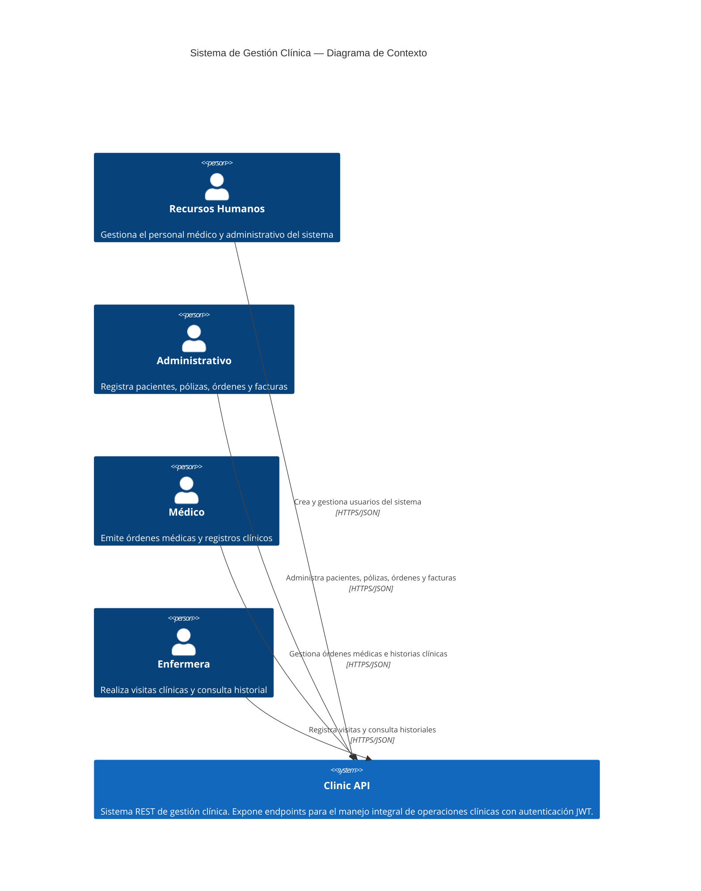

---

## Nivel 2 — Diagrama de Contenedores

Muestra los contenedores tecnológicos que conforman el sistema.

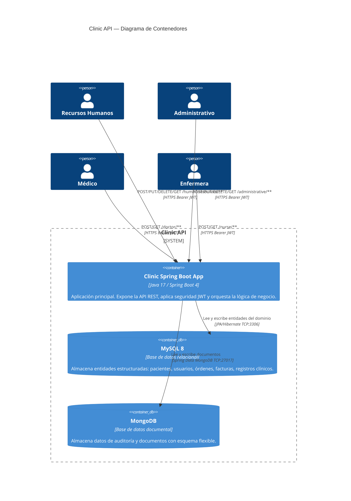

---

## Nivel 3 — Diagrama de Componentes (API)

Detalla los componentes internos de la aplicación Spring Boot.

```mermaid
C4Component
    title Clinic Spring Boot App — Diagrama de Componentes

    Container_Boundary(apiApp, "Clinic Spring Boot App") {

        Component(securityFilter, "JwtAuthFilter", "Spring Security Filter", "Intercepta cada request, valida el JWT y establece el contexto de autenticación.")
        Component(securityConfig, "SecurityConfig", "Spring Security Config", "Define reglas de autorización por rol y endpoints públicos.")

        Component(authCtrl, "AuthController", "REST Controller /auth", "Login de usuario. Retorna JWT token.")
        Component(hrCtrl, "HumanResourceController", "REST Controller /human-resources", "CRUD de usuarios (médicos, enfermeras, administrativos, RRHH).")
        Component(adminCtrl, "AdministrativeController", "REST Controller /administrative", "CRUD de pacientes, pólizas, contactos de emergencia, órdenes y facturas.")
        Component(doctorCtrl, "DoctorController", "REST Controller /doctor", "Creación de órdenes médicas y registros clínicos.")
        Component(nurseCtrl, "NurseController", "REST Controller /nurse", "Registro de visitas clínicas y lectura de historiales.")

        Component(authUC, "AuthUseCase", "Application Use Case", "Valida credenciales y genera JWT.")
        Component(hrUC, "HumanResourcesUseCase", "Application Use Case", "Lógica de negocio para gestión de usuarios.")
        Component(adminUC, "AdministrativeUseCase", "Application Use Case", "Lógica de negocio para gestión administrativa.")
        Component(doctorUC, "DoctorUseCase", "Application Use Case", "Lógica de negocio para operaciones médicas.")
        Component(nurseUC, "NurseUseCase", "Application Use Case", "Lógica de negocio para operaciones de enfermería.")

        Component(domainServices, "Domain Services", "Domain Layer", "CreatePatient, CreateOrder, CreateClinicalRecord, etc.")
        Component(ports, "Ports (Interfaces)", "Domain Layer", "PatientPort, UserPort, OrderPort, InvoicePort, ClinicalRecordPort, etc.")
        Component(persistence, "Persistence Adapters", "Infrastructure Layer", "Implementaciones JPA y MongoDB de los puertos del dominio.")
    }

    Rel(securityFilter, securityConfig, "Aplica reglas de autorización")
    Rel(authCtrl, authUC, "Delega autenticación")
    Rel(hrCtrl, hrUC, "Delega operaciones de RRHH")
    Rel(adminCtrl, adminUC, "Delega operaciones administrativas")
    Rel(doctorCtrl, doctorUC, "Delega operaciones médicas")
    Rel(nurseCtrl, nurseUC, "Delega operaciones de enfermería")

    Rel(authUC, domainServices, "Invoca servicios de dominio")
    Rel(hrUC, domainServices, "Invoca servicios de dominio")
    Rel(adminUC, domainServices, "Invoca servicios de dominio")
    Rel(doctorUC, domainServices, "Invoca servicios de dominio")
    Rel(nurseUC, domainServices, "Invoca servicios de dominio")

    Rel(domainServices, ports, "Usa interfaces de puertos")
    Rel(ports, persistence, "Implementado por adaptadores de persistencia")
```

---

## Nivel 3 — Diagrama de Componentes (Dominio)

Muestra los modelos de dominio y sus relaciones.

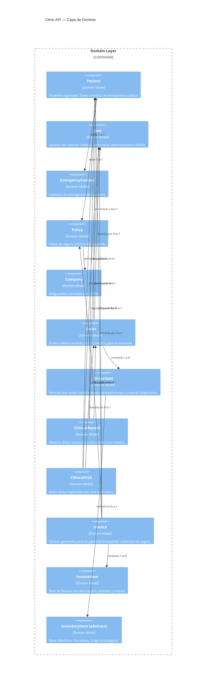

---

## Flujos de Secuencia

### Flujo 1: Autenticación JWT

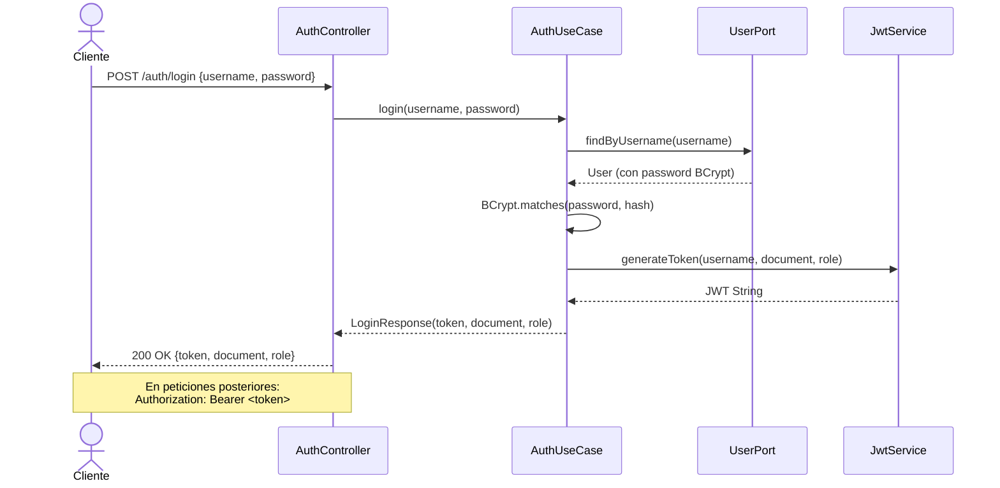

### Flujo 2: Creación de Paciente

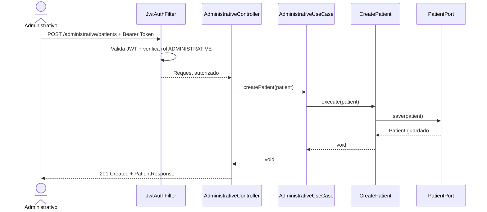

### Flujo 3: Creación de Orden Médica

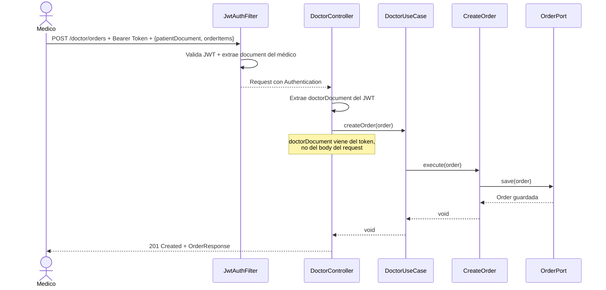

### Flujo 4: Registro de Visita Clínica

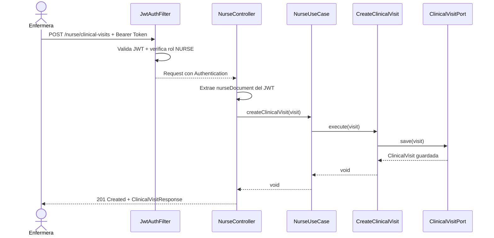

---

## Diagrama de Clases del Dominio

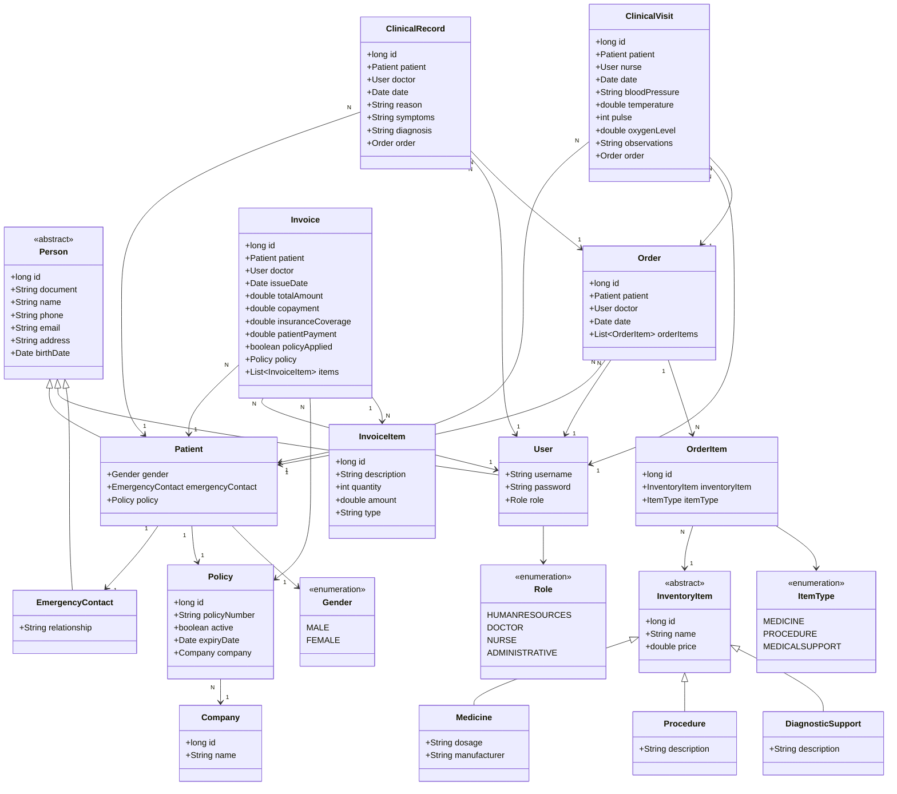

---

## Flujo de Seguridad JWT

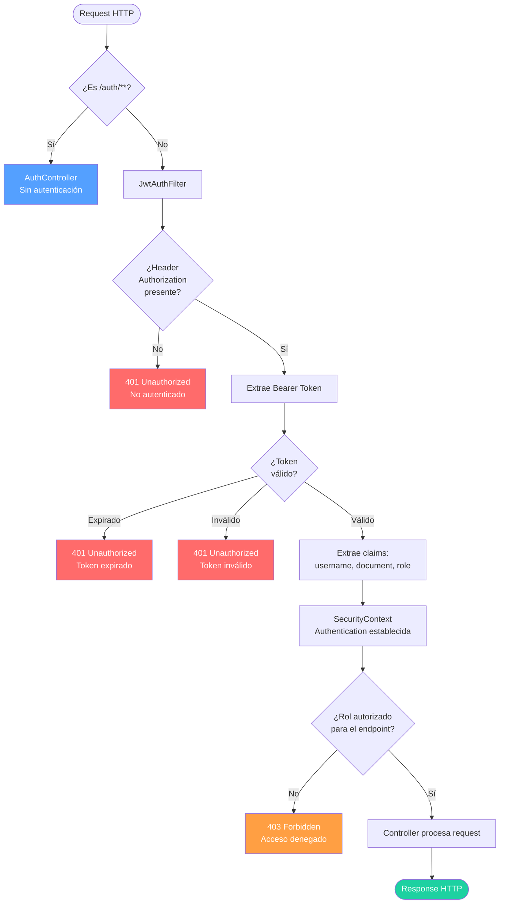

---

## Diagrama Entidad-Relación

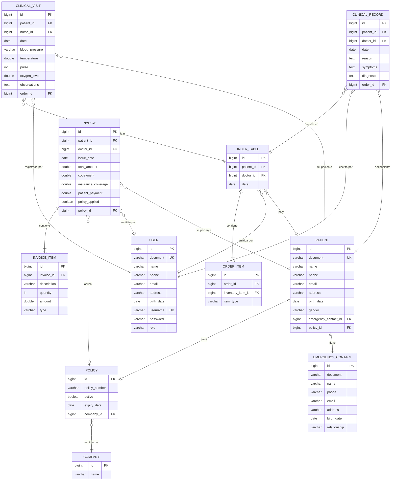
